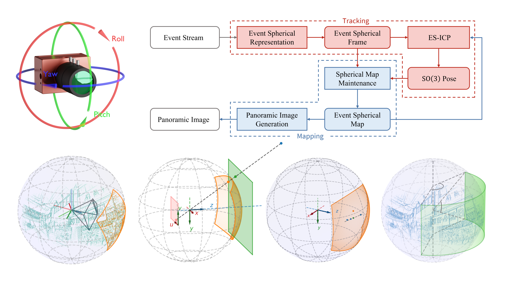

# EROAM: Event-based Camera Rotational Odometry and Mapping in Real-time

**IMPORTANT NOTE:** This code is released primarily for the purpose of academic review, as the accompanying paper is currently under peer review. We welcome feedback and suggestions.

[](https://wlxing1901.github.io/eroam/) [](https://youtu.be/8tF6b2VuvSM) [](https://arxiv.org/abs/2411.11004) [](https://transgp-my.sharepoint.com/:f:/g/personal/wl_xing_transgp_hk/Evz6VVBEYcVPrK5qhRBF1sIB-defWjkdOtLevZ0Oqe1JbA)

<p align="center">
  
</p>

## EROAM System Overview

EROAM is a novel, real-time event-based system for accurate camera rotational odometry and mapping. It addresses the limitations of traditional methods in high-speed scenarios by uniquely combining several key innovations:

* **Core Principle**: Instead of relying on event generation models or contrast maximization, EROAM introduces a **Spherical Event Representation**. Events are projected onto a unit sphere, simplifying rotation math and enabling continuous, high-resolution mapping.
* **Estimation Algorithm**: The system features the **Event Spherical Iterative Closest Point (ES-ICP)** algorithm, a geometric optimization framework specifically designed to efficiently align sparse event point clouds on the sphere using robust point-to-line metrics.
* **High-Frequency & Real-time**: EROAM operates at high frequencies (e.g., 1000 Hz) entirely on CPU. This ensures robust tracking of dynamic motions and provides excellent initial guesses for ES-ICP, contributing to its accuracy and real-time capability.
* **Efficient Long-Term Mapping**: For map management, EROAM employs an **incremental k-d tree (ikd-Tree)** and **Regional Density Management (RDM)**. This allows for stable computational costs during extended operation and prevents map degradation. The system architecture comprises a **Tracking Module** for high-frequency pose estimation and a **Mapping Module** for maintaining an efficient global spherical map.
* **Output**: The system delivers accurate $SO(3)$ pose estimates and generates high-quality panoramic images with fine structural details at arbitrary resolutions as a byproduct.

## Publication

Our paper is currently available on arXiv and is under peer review. If you find EROAM useful in your work, we would appreciate a citation to our arXiv preprint:

```bibtex
@article{xing2024eroam,
  title={EROAM: Event-based Camera Rotational Odometry and Mapping in Real-time},
  author={Xing, Wanli and Lin, Shijie and Yang, Linhan and Zhang, Zeqing and Du, Yanjun and Lei, Maolin and Pan, Yipeng and Pan, Jia},
  journal={arXiv preprint arXiv:2411.11004},
  year={2024}
}
```
You can find more details on our [Project Page](https://wlxing1901.github.io/eroam/) and read the preprint on [arXiv](https://arxiv.org/abs/2411.11004).

## Video

We have created comprehensive single-take video demonstrations available at [this YouTube link](https://youtu.be/8tF6b2VuvSM). These feature 12 distinct segments that showcase EROAM running in real-time across a wide spectrum of challenging scenarios, including static scenes, wide-range rotations, moving pedestrians, vehicles, motorcycles, pause-and-resume operations, night scenes, and the LimX TRON 1 robot platform. These demonstrations simultaneously capture the event camera in motion, the real-world scene, and the algorithm’s real-time output on a laptop screen.

## Datasets

We provide the **EROAM-campus dataset** used in our paper, which includes real-world sequences with event camera data and LiDAR-based ground truth for rotational motion.
You can download it from [this SharePoint link](https://transgp-my.sharepoint.com/:f:/g/personal/wl_xing_transgp_hk/Evz6VVBEYcVPrK5qhRBF1sIB-defWjkdOtLevZ0Oqe1JbA).

## Prerequisites

Ensure the following dependencies are installed:
* ROS1 Noetic ([Installation Guide](https://wiki.ros.org/noetic))
* iniVation DV ROS driver ([dv-ros](https://gitlab.com/inivation/dv/dv-ros))
* Eigen3
* Sophus
* Glog
* OpenCV
* PCL
* libtbb-dev
* (And other standard build tools like CMake, g++)

## Installation

1.  **Set up your Catkin Workspace:**
    ```bash
    mkdir -p ~/eroam_ws/src
    cd ~/eroam_ws/src
    ```
2.  **Clone Repositories:**
    Clone the iniVation DV ROS driver and the EROAM source code into your workspace's `src` directory.
    ```bash
    git clone https://gitlab.com/inivation/dv/dv-ros.git
    git clone git@github.com:wlxing1901/eroam.git
    ```
3.  **Build the Project:**
    Navigate to your workspace directory and use `catkin_make`.
    ```bash
    cd ~/eroam_ws
    catkin_make
    ```
4.  **Source the Workspace:**
    After a successful build, source the `setup.bash` file.
    ```bash
    source ~/eroam_ws/devel/setup.bash
    ```
    It's recommended to add this line to your `.bashrc` for convenience.

## Usage

1.  **Download Data:**
    Download the `eroam_data` from [this SharePoint link](https://transgp-my.sharepoint.com/:f:/g/personal/wl_xing_transgp_hk/Evz6VVBEYcVPrK5qhRBF1sIB-defWjkdOtLevZ0Oqe1JbA). This link contains the datasets used for testing.

2.  **Configure Launch File:**
    Open the `eroam_run_campus.launch` file located in the `eroam` package (e.g., `~/eroam_ws/src/eroam/launch/eroam_run_campus.launch`).
    Modify the following line to point to the correct path of your downloaded rosbag data:
    ```xml
    <node name="rosbag_play" pkg="rosbag" type="play" args="-d 3.0 path_to_your_data"/>
    ```
    Replace `path_to_your_data` with the actual path to your `.bag` file. For example:
    ```xml
    <node name="rosbag_play" pkg="rosbag" type="play" args="-d 3.0 /path/to/your/downloaded/dataset.bag"/>
    ```

3.  **Run EROAM:**
    Execute the launch file:
    ```bash
    roslaunch eroam eroam_run_campus.launch
    ```

4.  **Visualization and Termination:**
    The program will launch RViz to visualize the EROAM execution. Wait for the rosbag to finish playing and for EROAM to complete processing. Once processing is done, press `Ctrl+C` to terminate the program.
    
    **Note:** RViz visualization might experience lag if the accumulated point cloud in the map becomes very dense. This typically does not affect the core EROAM algorithm's performance.

5.  **Output and Performance Metrics:**
    After termination, the terminal will display performance metrics, including the number of calls and average execution time for key steps:
    ```
    I20250609 17:31:00.751452  8102 eroam.hpp:371] EROAM: done.
    I20250609 17:31:00.751473  8102 timer.cc:12] >>> ===== Printing run time =====
    I20250609 17:31:00.751477  8102 timer.cc:14] > [ EROAM: ev_sphere_frame warp ] average time usage: 0.060079 ms , called times: 36274
    I20250609 17:31:00.751510  8102 timer.cc:14] > [ EROAM: event spherical icp ] average time usage: 0.585088 ms , called times: 36267
    I20250609 17:31:00.751541  8102 timer.cc:14] > [ EROAM: full time ] average time usage: 0.713804 ms , called times: 41081
    I20250609 17:31:00.751578  8102 timer.cc:14] > [ EROAM: ikd-Tree initial build ] average time usage: 1.00224 ms , called times: 1
    I20250609 17:31:00.751593  8102 timer.cc:14] > [ EROAM: ikd-tree update ] average time usage: 0.38847 ms , called times: 1683
    I20250609 17:31:00.751598  8102 timer.cc:14] > [ EROAM: map_frame_world copy ] average time usage: 0.00113396 ms , called times: 1683
    I20250609 17:31:00.751605  8102 timer.cc:14] > [ EROAM: pubish everything ] average time usage: 0.0636827 ms , called times: 36267
    I20250609 17:31:00.751636  8102 timer.cc:14] > [ EROAM: saving panoramic image ] average time usage: 5469.19 ms , called times: 1
    I20250609 17:31:00.751639  8102 timer.cc:14] > [ EROAM: saving pose result ] average time usage: 80.9835 ms , called times: 1
    I20250609 17:31:00.751642  8102 timer.cc:14] > [ EROAM: undistortion and projection ] average time usage: 0.0251254 ms , called times: 36274
    I20250609 17:31:00.751672  8102 timer.cc:19] >>> ===== Printing run time end =====
    ```
    The panoramic image and estimated pose trajectory will be saved to an `output` directory (e.g., `~/eroam_ws/src/eroam_opensource_test/output/` or as specified in your launch/config files).

## Contact

For questions or support, please open an issue on GitHub or contact wlxing@connect.hku.hk